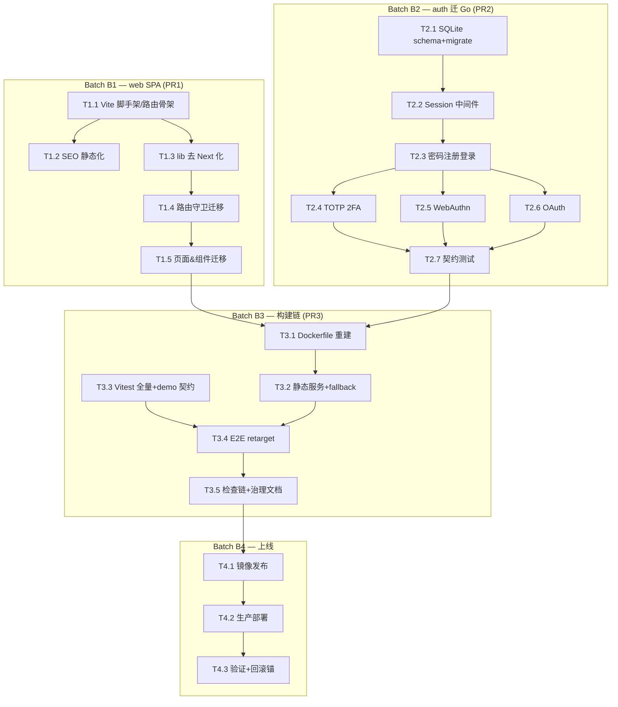

# Dependency Graph

## Lane 与合并风险

| Lane | 内容 | 文件域 | 合并风险 |
|:-----|:-----|:-------|:---------|
| A | 前端迁移 | `apps/web/src/**`、`package.json` | 低（独享） |
| B | Go auth | `apps/api-go/**`、`go.mod` | 低（独享） |
| C | 构建/测试 | `Dockerfile`、`docker/**`、`playwright.config.ts`、`scripts/**` | 基线集成后低 |
| D | 发布 | `deploy/**`、compose | 低 |

B1/B2 可并行；B3 需 B1+B2 集成基线；B4 在 B3 绿后。
