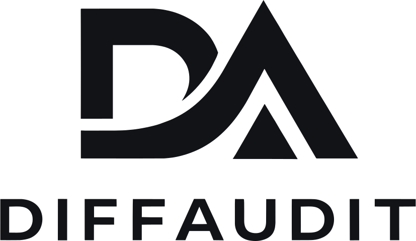
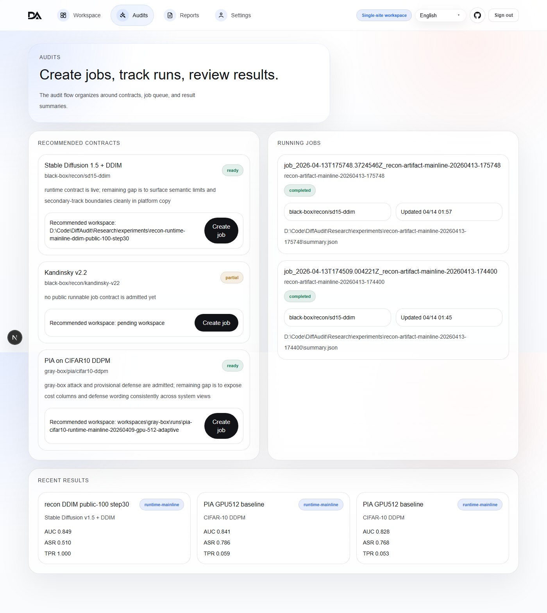

<div align="center">



**Privacy-Risk Audit Workspace for Diffusion Models**
**扩散模型隐私风险审计工作台**

---

[](LICENSE)
[](https://nextjs.org)
[](https://react.dev)
[](https://go.dev)
[](https://www.typescriptlang.org)

**Live Demo** · [diffaudit.vectorcontrol.tech](https://diffaudit.vectorcontrol.tech)

[English](#english) · [简体中文](#简体中文)

</div>

---

## English

**DiffAudit Platform** is an open-source workspace for auditing privacy risks
in diffusion models. It turns research evidence into a
reviewable product experience — contracts, metrics, reports, exports — so that
security teams, model developers, and compliance reviewers can inspect
training-data membership risks without digging through experiment logs.

### What It Does

Modern diffusion models can memorize training samples. When that happens,
attackers can infer whether a given image was used during training — a
membership inference risk that matters for data compliance, copyright, and
privacy.

DiffAudit Platform provides one place to answer three practical questions:

| Question | Surface |
| --- | --- |
| **What can we audit?** | Catalog and workspace overview |
| **What did the evidence say?** | Attack-defense tables, metrics, provenance |
| **How do we share the result?** | PDF / CSV export, report pages |

The platform organizes audits along **three permission tiers** — black-box,
gray-box, white-box — forming a risk gradient from "we can only see the output"
to "we have full access to the model."

### Quick Look



### Capabilities

- **Audit workspace** — dashboard, catalog, job lifecycle, re-audit shortcuts
- **Evidence views** — attack/defense comparison, risk charts, provenance panels, coverage gaps
- **Report exports** — PDF and CSV, ready for review meetings or compliance archives
- **Bilingual UI** — English and Simplified Chinese, with dark-mode
- **Snapshot-backed read plane** — demo-ready even without a live runtime
- **Optional runtime bridge** — connect to [DiffAudit Runtime](https://github.com/DeliciousBuding/DiffAudit-Runtime) for live job execution
- **OAuth** — GitHub and Google sign-in, plus local credentials

### Architecture

```
Browser → Next.js Web App → Go API Gateway → Snapshot Bundle (demo / read)
                                         → Runtime Server (optional, live jobs)
```

The platform separates **read** and **control** paths. The read path serves a
public snapshot bundle — zero dependency on a running runtime for browsing
evidence. The control path proxies job requests to the runtime service when
live execution is needed.

For a full walkthrough see [docs/architecture.md](docs/architecture.md).

### Quick Start

```bash
# Prerequisites: Node.js ≥20, Go ≥1.22

git clone https://github.com/DeliciousBuding/DiffAudit-Platform.git
cd DiffAudit-Platform

# Install and run the web app
npm --prefix apps/web install
npm run dev:web              # → http://localhost:3000

# In another terminal — start the API gateway
npm run dev:api              # → http://127.0.0.1:8780
```

The frontend ships with demo data. Open `http://localhost:3000` and you'll
see the workspace right away — no runtime, no database, no config needed.

### Documentation

| Document | Covers |
| --- | --- |
| [docs/architecture.md](docs/architecture.md) | System boundaries, read/control planes, data objects |
| [docs/portability.md](docs/portability.md) | Deployment contract and public-ready checklist |
| [apps/web/README.md](apps/web/README.md) | Web app details |
| [apps/api-go/README.md](apps/api-go/README.md) | Gateway routes |
| [deploy/README.md](deploy/README.md) | Docker templates |

### Companion Repositories

| Repository | Role |
| --- | --- |
| [DiffAudit-Runtime](https://github.com/DeliciousBuding/DiffAudit-Runtime) | Runtime service — job scheduling, runner orchestration, SQLite-backed contract registry |
| [DiffAudit-Research](https://github.com/DeliciousBuding/DiffAudit-Research) | Research evidence — experiments, attack/defense artifacts, admitted results |

### Contributing

Issues and PRs are welcome. Before submitting, run the checks in
[CONTRIBUTING.md](CONTRIBUTING.md). Keep secrets and local paths out of
commits. Demo data must be safe for public review.

### Security

For sensitive vulnerabilities, use GitHub's private reporting or contact the
maintainer directly. Never commit API keys, OAuth secrets, databases, or raw
datasets.

### License

Apache License 2.0 — commercial use, modification, and distribution are
permitted. See [LICENSE](LICENSE).

---

## 简体中文

**DiffAudit Platform** 是一个开源的扩散模型隐私风险审计工作台。它把研究证据转化为可交互的产品体验——合同项、指标对比、报告导出——让安全团队、模型开发者和合规审查人员可以直接在浏览器里评估训练数据泄露风险，不用去翻实验脚本。

### 解决什么问题

扩散模型在训练过程中可能"记住"训练样本。一旦被记忆，攻击者就能推断某张图片是否参与过训练——这种成员推理风险对数据合规、版权保护和隐私安全都是实实在在的威胁。

DiffAudit Platform 围绕三个问题提供答案：

| 问题 | 对应能力 |
| --- | --- |
| **能审计什么？** | 合同项目录与工作区概览 |
| **证据怎么说？** | 攻击-防御对比表、指标卡片、来源面板 |
| **怎么把结果给出去？** | PDF / CSV 导出、报告页面 |

平台按**黑盒、灰盒、白盒**三种权限场景组织审计，形成从"只看得见输出"到"模型内部全开放"的风险评估梯度。

### 快速体验

在线 Demo：[diffaudit.vectorcontrol.tech](https://diffaudit.vectorcontrol.tech)

本地启动：

```bash
# 前提：Node.js ≥20，Go ≥1.22

git clone https://github.com/DeliciousBuding/DiffAudit-Platform.git
cd DiffAudit-Platform

npm --prefix apps/web install
npm run dev:web              # → http://localhost:3000

# 另开终端启动 API 网关
npm run dev:api              # → http://127.0.0.1:8780
```

前端自带演示数据，打开浏览器就能看到工作台——不需要配数据库，不需要启动运行时。

### 主要能力

- **审计工作台** — 仪表板、合同项目录、任务生命周期、一键重审
- **证据展示** — 攻击/防御对比、风险图表、来源追溯、覆盖缺口
- **报告导出** — PDF 和 CSV，用于评审会或合规归档
- **双语界面** — 中英文切换，支持深色模式
- **Snapshot 驱动** — 展示通道读取预发布数据包，不依赖运行时也能完整浏览
- **可选运行时桥接** — 接入 [DiffAudit Runtime](https://github.com/DeliciousBuding/DiffAudit-Runtime) 后支持实时任务执行
- **灵活登录** — 本地账号、GitHub OAuth、Google OAuth 三种方式

### 架构

```
浏览器 → Next.js 前端 → Go API 网关 → Snapshot 数据包（演示 / 只读）
                                    → Runtime 服务（可选，实时任务）
```

平台在工程上分离了展示通道和控制通道。展示通道吃 snapshot，Runtime 挂了页面照样能用。控制通道只在用户主动提交任务时才跟 Runtime 通信。

详见 [docs/architecture.md](docs/architecture.md)。

### 配套仓库

| 仓库 | 定位 |
| --- | --- |
| [DiffAudit-Runtime](https://github.com/DeliciousBuding/DiffAudit-Runtime) | 运行时服务——任务调度、Runner 编排、SQLite 合同项注册 |
| [DiffAudit-Research](https://github.com/DeliciousBuding/DiffAudit-Research) | 研究证据——实验、攻击/防御工件、admitted 结果 |

### 参与贡献

欢迎提 Issue 和 PR。提交前请跑一下 [CONTRIBUTING.md](CONTRIBUTING.md) 里的验证命令。不要把密钥、本地路径、私有数据集写进提交。

### 安全

敏感漏洞请通过 GitHub 私有报告流程提交，或直接联系维护者。严禁提交 API Key、OAuth 密钥、数据库导出或原始私有数据集。

### 许可证

Apache License 2.0 — 允许商用、修改和分发。详见 [LICENSE](LICENSE)。
