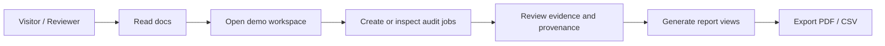
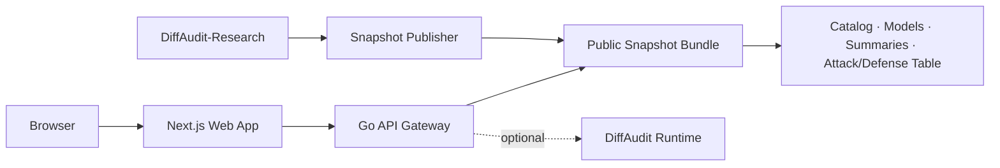

<div align="center">

# DiffAudit Platform

**Privacy-risk audit workspace for machine-learning models.**<br>
**面向机器学习模型的隐私风险审计工作台。**

[](https://github.com/DeliciousBuding/DiffAudit-Platform/actions/workflows/ci.yml)


[English](#english) · [简体中文](#简体中文) · [Quick Start](#quick-start) · [Documentation](#documentation) · [License](#license)

</div>

---

## English

DiffAudit Platform is the product-facing workspace for **DiffAudit**, a privacy audit system for evaluating whether machine-learning models leak training-data membership signals.

It combines a polished Next.js interface, a snapshot-backed Go API gateway, demo-ready audit flows, report pages, export tooling, and integration contracts for the broader DiffAudit ecosystem.

The companion research line lives in [DiffAudit-Research](https://github.com/DeliciousBuding/DiffAudit-Research), which contains the experiment and evidence production side of the project.

## 简体中文

DiffAudit Platform 是 **DiffAudit** 的产品化工作台，用于展示、复现和审阅机器学习模型中的隐私泄露风险，尤其是训练数据成员推断相关风险。

本仓库包含 Next.js 前端、Go API Gateway、演示模式审计流程、报告页面、导出能力，以及与 DiffAudit 研究与运行时体系对接的公开契约。

研究主线位于 [DiffAudit-Research](https://github.com/DeliciousBuding/DiffAudit-Research)，负责实验、证据生成和研究结果沉淀。

### 中文速览

| 你关心的问题 | DiffAudit Platform 提供的能力 |
| --- | --- |
| 如何向评委、团队或客户解释模型隐私风险？ | 用工作台、证据表和报告页把实验结果转成可审阅的产品流程 |
| 没有运行时服务能不能演示？ | 可以，默认支持 snapshot/demo 数据 |
| 能不能接真实实验结果？ | 可以，通过 DiffAudit-Research 生成证据，再发布为 public snapshot |
| 能不能导出材料？ | 支持 PDF 和 CSV 导出路径，适合技术评审和报告归档 |
| 能不能商用？ | Apache-2.0 许可证允许商用和二次开发，需保留版权与许可证声明 |

## Why DiffAudit / 为什么需要 DiffAudit

Modern AI systems are often evaluated for accuracy, latency, and cost, but privacy leakage can remain invisible until the model is already deployed. DiffAudit turns privacy-risk evidence into a workflow that product, security, compliance, and research teams can inspect together.

DiffAudit focuses on three practical questions:

| Question | DiffAudit Surface |
| --- | --- |
| What models or audit contracts are available? | Catalog and workspace overview |
| What does the evidence say? | Attack-defense tables, metrics, provenance panels |
| How do we share the result? | Report pages, PDF export, CSV export |

## Highlights / 功能亮点

- **Demo-first workspace**: explore contracts, jobs, metrics, reports, API keys, account, and settings without requiring a live runtime.
- **Evidence-aware reports**: view track-level metrics, ROC/risk charts, provenance, coverage gaps, and exportable audit summaries.
- **Bilingual product shell**: English and Simplified Chinese UI with global language and theme controls.
- **Snapshot-backed API**: Go gateway serves public catalog/model/evidence bundles for deterministic demos and stable review.
- **Optional runtime bridge**: audit-job control-plane routes can proxy to a runtime service when configured.
- **Auth-ready surface**: local credentials plus optional GitHub and Google OAuth providers.
- **Public trial hook**: trial intake can point to an external form for demos, pilots, or onboarding.
- **CI-verified baseline**: web lint/test/build and Go test/build run in GitHub Actions.

## Product Flow / 产品流程



## Architecture / 架构



| Layer | Path | Responsibility |
| --- | --- | --- |
| Web app | [`apps/web`](apps/web) | Marketing site, docs, auth, workspace, audits, reports, account, settings |
| API gateway | [`apps/api-go`](apps/api-go) | Snapshot-backed read API and optional runtime proxy |
| Shared contracts | [`packages/shared`](packages/shared) | Stable payload examples and contract notes |
| Public docs | [`docs`](docs) | Architecture and developer orientation |
| CI | [`.github/workflows/ci.yml`](.github/workflows/ci.yml) | Frontend and Go quality gates |

## Capability Matrix / 能力矩阵

| Capability | Status | Notes |
| --- | --- | --- |
| Landing page and docs | Available | Product explanation, docs navigation, bilingual interface |
| Workspace dashboard | Available | Demo-mode metrics, contracts, task summaries |
| Audit job flow | Available | Demo job store locally; runtime proxy when configured |
| Reports | Available | Evidence stack, provenance, charts, PDF/CSV export |
| Authentication | Available | Local credentials, optional GitHub/Google OAuth |
| Snapshot API | Available | Catalog, models, summaries, attack-defense table |
| Runtime execution | External integration | Implemented by the runtime service, consumed through API contracts |
| Research evidence | External integration | Produced by DiffAudit-Research and published into snapshots |

## Quick Start / 快速开始

### Prerequisites

- Node.js 20+
- npm 10+
- Go 1.22+
- Python 3.10+ for helper scripts

### Install

```powershell
git clone https://github.com/DeliciousBuding/DiffAudit-Platform.git
cd DiffAudit-Platform
npm --prefix apps/web install
```

### Run the web app

```powershell
npm run dev:web
```

Open `http://localhost:3000`.

### Run the Go gateway

In another terminal:

```powershell
npm run dev:api
```

The default gateway URL is `http://127.0.0.1:8780`.

## Configuration / 配置

Copy `.env.example` into an untracked local file such as `apps/web/.env.local`, then change only the values you need.

```powershell
Copy-Item .env.example apps/web/.env.local
```

| Variable | Used by | Purpose |
| --- | --- | --- |
| `DIFFAUDIT_PLATFORM_URL` | web | Base URL used for auth redirects |
| `DIFFAUDIT_API_BASE_URL` | web | Go gateway URL |
| `DIFFAUDIT_DB_PATH` | web | SQLite path for local users and sessions |
| `DIFFAUDIT_DEMO_MODE` | web/api | Enables demo-mode defaults |
| `DIFFAUDIT_FORCE_DEMO_MODE` | web | Optional override that keeps demo mode enabled even if a user cookie tries to disable it |
| `DIFFAUDIT_PRIMARY_CONTRACT_KEY` | web | Optional preferred contract key for landing-page evidence selection |
| `DIFFAUDIT_SHARED_USERNAME` | web | Optional first local account username |
| `DIFFAUDIT_SHARED_PASSWORD` | web | Optional first local account password |
| `GITHUB_CLIENT_ID` / `GITHUB_CLIENT_SECRET` | web | Optional GitHub OAuth provider |
| `GOOGLE_CLIENT_ID` / `GOOGLE_CLIENT_SECRET` | web | Optional Google OAuth provider |
| `DIFFAUDIT_TRIAL_FORM_URL` | web | Optional external trial intake form |
| `DIFFAUDIT_PUBLIC_DATA_DIR` | api | Public snapshot data directory |
| `DIFFAUDIT_RUNTIME_BASE_URL` | api | Optional runtime upstream |
| `DIFFAUDIT_CORS_ALLOWED_ORIGINS` | api | Allowed browser origins for the gateway |

OAuth buttons render only when the matching provider has both client ID and client secret configured.

## Container Deployment / 容器部署

Docker is the recommended deployment shape when the target environment needs reproducible builds and rollback-friendly image tags. The repository includes public-safe templates only; real secrets and server-specific settings stay outside Git.

Build traceable local images from a clean commit:

```powershell
powershell -ExecutionPolicy Bypass -File .\scripts\build_docker_images.ps1
```

Run the generic compose template:

```powershell
Copy-Item .\deploy\compose.env.example .\deploy\.env
Copy-Item .\deploy\runtime.env.example .\deploy\runtime.env
docker compose --env-file .\deploy\.env -f .\deploy\docker-compose.example.yml up -d --build
```

The copied `deploy/.env` and `deploy/runtime.env` files are ignored by Git. Set OAuth secrets, public platform URL, CORS origins, snapshot host path, and deployment-specific bind values there or in your deployment secret manager.

GitHub Container Registry publishing is supported through the `Publish Images` workflow. Published image names are:

- `ghcr.io/deliciousbuding/diffaudit-platform-web`
- `ghcr.io/deliciousbuding/diffaudit-platform-api`

Use immutable `sha-<short-sha>` tags for deployment pinning. Use `latest` only for demos or local evaluation.

See [deploy/README.md](deploy/README.md) for the template contract.

## Portability / 可迁移化

The portable baseline is source code plus a sanitized public snapshot plus environment variables. Private deployment topology, raw Research workspaces, local databases, OAuth secrets, and server-local process files stay outside Git.

迁移基线由源码、可公开的 snapshot 和环境变量组成。私有部署拓扑、原始 Research 工作区、本地数据库、OAuth 密钥和服务器本地进程文件不进入 Git。

See [docs/portability.md](docs/portability.md) for the migration model, environment groups, snapshot contract, and public-ready checklist.

## Research And Runtime Integration / 研究与运行时集成

DiffAudit Platform is designed to sit between research evidence and product review.

- [DiffAudit-Research](https://github.com/DeliciousBuding/DiffAudit-Research) produces experiment artifacts, attack/defense evidence, and admitted result tables.
- Snapshot publishing turns selected evidence into `apps/api-go/data/public`.
- The Go gateway serves snapshot-backed read APIs for stable demos and reports.
- Runtime execution can be connected through `DIFFAUDIT_RUNTIME_BASE_URL` for live job control-plane routes.

Public routes read the generated snapshot bundle. If you want new research evidence to appear in the UI, publish it into the snapshot bundle first.

## Verification / 验证

Run the standard local gates before opening a PR:

```powershell
python scripts/check_public_boundary.py
npm --prefix apps/web run lint
npm --prefix apps/web run test
npm --prefix apps/web run build
go -C apps/api-go test ./...
```

Or run the repository helper:

```powershell
python scripts/run_local_checks.py
```

## Documentation / 文档

| Document | Purpose |
| --- | --- |
| [docs/README.md](docs/README.md) | Documentation map |
| [docs/architecture.md](docs/architecture.md) | Architecture and data boundaries |
| [docs/portability.md](docs/portability.md) | Productization and migration contract |
| [docs/platform-roadmap.md](docs/platform-roadmap.md) | Public product roadmap and implementation guardrails |
| [apps/web/README.md](apps/web/README.md) | Web app setup and notes |
| [apps/api-go/README.md](apps/api-go/README.md) | Gateway routes and local usage |
| [deploy/README.md](deploy/README.md) | Public-safe Docker deployment template |
| [apps/web/DESIGN.md](apps/web/DESIGN.md) | Product UI and design notes |
| [AGENTS.md](AGENTS.md) | Agent guardrails for public-safe changes |
| [CONTRIBUTING.md](CONTRIBUTING.md) | Contribution workflow |

## Roadmap / 路线图

| Area | Direction |
| --- | --- |
| Evidence UX | More compact provenance views, richer coverage-gap explanations |
| Workspace observability | Snapshot age, build revision, and Runtime mode surfaced consistently |
| Report exports | Better academic/report templates and stable printable layouts |
| Runtime bridge | Stronger live-job observability and retry/error handling |
| Public trial | Cleaner onboarding flow and optional external intake integration |
| Research sync | Cleaner handoff from DiffAudit-Research artifacts into public snapshots |

## Contributing / 参与贡献

Issues and pull requests are welcome for documentation, UI improvements, test coverage, and integration-contract polish. For larger changes, open an issue first so the scope can be discussed.

Before submitting:

- run the verification commands above;
- keep environment files and secrets out of Git;
- keep demo data suitable for public review;
- document user-facing behavior changes.

## Security / 安全

Please do not open public issues for sensitive vulnerabilities. Use GitHub private vulnerability reporting if available, or contact the maintainer privately.

Do not commit API keys, OAuth secrets, database dumps, environment-specific hostnames, local user paths, or raw private datasets.

## License / 许可证

DiffAudit Platform is licensed under the **Apache License 2.0**. See [LICENSE](LICENSE).

Summary:

- commercial use, modification, distribution, and private use are allowed under Apache-2.0;
- copyright and license notices must be preserved;
- contributions and third-party dependencies remain under their respective licenses.

中文摘要：

- Apache-2.0 允许商用、修改、分发和私有使用；
- 需要保留版权与许可证声明；
- 贡献代码和第三方依赖仍遵循其各自许可证。
