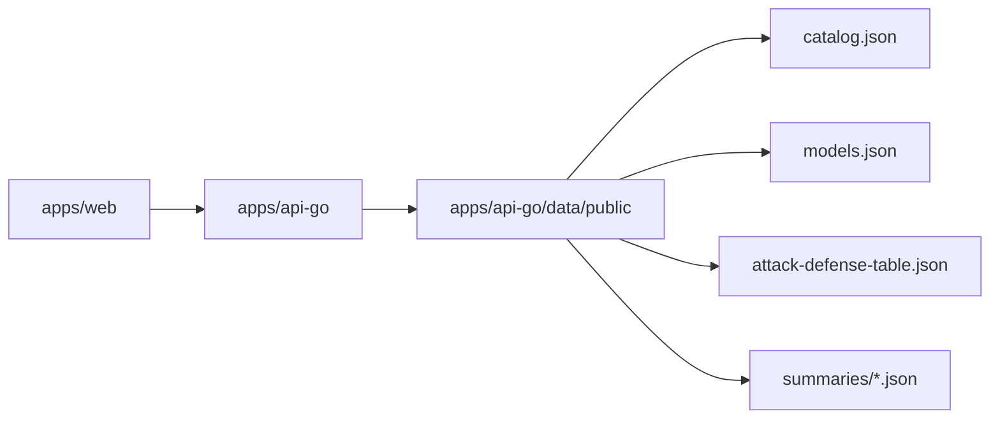

# DiffAudit Platform Architecture

DiffAudit Platform is the product layer for browsing privacy audit evidence and operating audit workflows. It is intentionally separated from research execution and long-running runtime orchestration.

## System Boundaries

| Layer | Responsibility | This repo owns it |
| --- | --- | --- |
| Web product | Marketing, docs, auth, workspace, audit flow, reports, account/settings UI | Yes, `apps/web` |
| Platform gateway | Snapshot read API and optional Runtime proxy | Yes, `apps/api-go` |
| Shared contracts | Stable payload examples and schema notes | Yes, `packages/shared` |
| Runtime service | Job scheduling, runner orchestration, live control plane | No |
| Research assets | Experiments, raw workspaces, model evidence generation | No |

Platform should consume research and runtime outputs through explicit snapshots or HTTP contracts. It should not copy research execution logic into the web app.

## Read Plane

The default read path is snapshot-backed:

Snapshot-backed routes include:

- `GET /health`
- `GET /api/v1/catalog`
- `GET /api/v1/evidence/attack-defense-table`
- `GET /api/v1/models`
- `GET /api/v1/experiments/recon/best`
- `GET /api/v1/experiments/{workspace}/summary`

If a required snapshot is unavailable, the gateway should fail clearly rather than attempting to discover research workspaces at request time.

## Control Plane

Runtime control-plane integration is optional:

- `GET /api/v1/audit/job-template`
- `GET /api/v1/audit/jobs`
- `POST /api/v1/audit/jobs`
- `GET /api/v1/audit/jobs/{job_id}`
- `DELETE /api/v1/audit/jobs/{job_id}`

The web app must remain usable in demo mode when the Runtime service is not configured. Real job execution should be enabled only when a trusted Runtime upstream is explicitly supplied.

## Core Data Objects

| Object | Purpose |
| --- | --- |
| `catalog_entry` | Describes auditable contracts, maturity, evidence level, and display metadata |
| `evidence_summary` | Describes the best available evidence for a method/model/workspace |
| `audit_job` | Describes an audit request and its current control-plane state |
| `attack_defense_row` | Describes comparable attack/defense measurements for reports |

These objects should degrade gracefully when optional fields are missing. Public pages should render `-` or an explicit empty state instead of crashing.

## Publish-Time Fallback

The snapshot publisher may use a checked-out research repository while preparing a public bundle. That is a publish-time concern only. Request handlers should continue to read the generated snapshot bundle.

## Public Data Boundary Contract

| Boundary | Allowed at publish time | Allowed at request time |
| --- | --- | --- |
| Research outputs | Read selected, sanitized artifacts while generating the public snapshot | No filesystem discovery and no raw Research workspace reads |
| Snapshot bundle | Generate, validate, and sanitize public JSON | Serve `apps/api-go/data/public` or configured public snapshot directory only |
| Runtime control plane | Query configured Runtime while publishing or proxying explicit job-control routes | Proxy only explicit `/api/v1/audit/*` and `/api/v1/control/runtime` routes through public-safe errors |
| Demo mode | Seed deterministic review data | Serve snapshot/demo view models without contacting Runtime |
| Public UI errors | Record generic warnings and source labels | Do not show hostnames, URLs, local paths, tokens, raw network errors, or stack traces |

## Security Practices

Public examples should use placeholders for credentials, host-specific settings, and deployment-specific configuration. Runtime URLs, OAuth secrets, data paths, and API keys should be supplied through environment variables or a deployment secret store.

Snapshot files are treated as distributable demo data. Review them before publishing to ensure they contain logical artifact identifiers rather than machine-local paths or credentials.

## Deployment Boundary

The public repository owns buildable artifacts and generic templates:

- Dockerfiles for the web app and Go gateway;
- `deploy/docker-compose.example.yml` for local or server-side composition;
- example environment files that contain placeholders only;
- OCI image labels that record the source repository, license, build date, and Git revision.

The deployment environment owns private operational state:

- real environment files and OAuth secrets;
- public domains, bind addresses, TLS/proxy configuration, and certificates;
- host-specific paths, process managers, SSH aliases, and operational notes;
- sanitized public snapshot bundles selected for that environment.

This split keeps the repository suitable for public review while still supporting reproducible Docker deployment.

## Portability Contract

The portable Platform unit is:

- a clean Git revision or image built from one;
- a sanitized public snapshot bundle;
- environment variables supplied by the deployment environment;
- optional Runtime connectivity through `DIFFAUDIT_RUNTIME_BASE_URL`.

The repository must remain usable without private server notes, raw Research directories, or deployment-specific files. See [portability.md](portability.md) for the migration checklist and environment groups.
