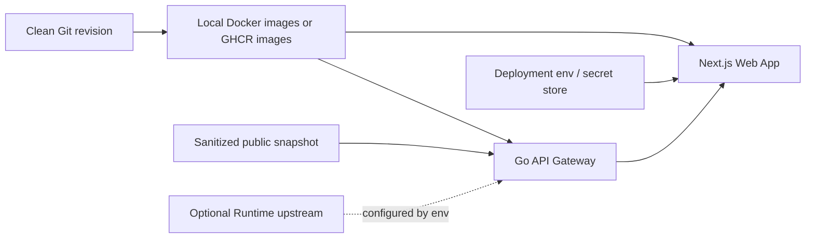

# Productization And Portability

DiffAudit Platform is packaged as a public, portable product layer. A clean checkout should be understandable without private server notes, and a deployment should be reproducible from source, public-safe snapshots, and environment variables.

中文：DiffAudit Platform 按公开、可迁移的产品层维护。干净 checkout 不依赖私有服务器笔记；部署应只依赖源码、可公开的 snapshot 和环境变量。

## Portable Units

| Unit | What moves with the repository | What stays outside Git |
| --- | --- | --- |
| Web product | `apps/web`, static assets, localized copy, auth shell, workspace UI, report export UI | Real OAuth secrets, local SQLite files, session data |
| API gateway | `apps/api-go`, snapshot-backed read routes, optional Runtime proxy, publisher tests | Private Runtime topology, host-specific process manager files |
| Public snapshot | Sanitized files under `apps/api-go/data/public` or another configured public snapshot directory | Raw Research workspaces, private datasets, local file paths, model checkpoints |
| Shared contracts | `packages/shared` examples and schema notes | Private downstream agreements or unpublished datasets |
| Deployment template | Dockerfiles, compose templates, GHCR workflow, placeholder env files | Real domains, TLS/proxy config, certificates, SSH aliases, bind paths, server notes |

## Migration Model

Migration has three independent tracks:

1. Move the code or container images pinned to a Git revision.
2. Move a sanitized public snapshot bundle.
3. Recreate environment variables and secrets in the target deployment environment.

Do not migrate private runbooks, raw server files, local databases, shell history, or raw Research directories into this repository.

## Environment Groups

| Group | Variables |
| --- | --- |
| Platform URL and API | `DIFFAUDIT_PLATFORM_URL`, `DIFFAUDIT_API_BASE_URL`, `DIFFAUDIT_CORS_ALLOWED_ORIGINS` |
| Local state | `DIFFAUDIT_DB_PATH` |
| Demo behavior | `DIFFAUDIT_DEMO_MODE`, `DIFFAUDIT_FORCE_DEMO_MODE`, `DIFFAUDIT_PRIMARY_CONTRACT_KEY` |
| Optional auth | `DIFFAUDIT_SHARED_USERNAME`, `DIFFAUDIT_SHARED_PASSWORD`, `GITHUB_CLIENT_ID`, `GITHUB_CLIENT_SECRET`, `GOOGLE_CLIENT_ID`, `GOOGLE_CLIENT_SECRET` |
| Public intake | `DIFFAUDIT_TRIAL_FORM_URL` |
| Gateway data | `DIFFAUDIT_PUBLIC_DATA_DIR`, `DIFFAUDIT_RUNTIME_BASE_URL` |
| Build metadata | `DIFFAUDIT_BUILD_REVISION`, `DIFFAUDIT_BUILD_DATE` |

Only placeholders belong in committed examples. Real values belong in untracked `.env` files, compose env files, CI secrets, or the target platform secret store.

## Snapshot Portability

The request-time API reads a public snapshot directory. It must not discover local Research folders during browser requests.

To move evidence into a new deployment:

1. Publish or copy a sanitized snapshot bundle.
2. Point `DIFFAUDIT_PUBLIC_DATA_DIR` or `DIFFAUDIT_PUBLIC_SNAPSHOT_DIR` at that bundle.
3. Confirm the snapshot manifest records generic `source` and `warnings` values.
4. Run the public boundary check before committing any changed snapshot files.

`DiffAudit-Research` remains the evidence production line. Platform consumes selected outputs only after they have been converted into public snapshot files.

## Runtime Portability

Runtime integration is optional. Without `DIFFAUDIT_RUNTIME_BASE_URL`, the Platform remains usable in demo and snapshot-backed modes.

When connecting a Runtime service:

- configure the Runtime URL outside Git;
- expose only explicit audit control-plane routes through the gateway;
- keep raw Runtime exceptions, hostnames, ports, and local paths out of browser responses;
- preserve demo-mode behavior so the workspace remains reviewable when Runtime is unavailable.

## Container Paths

Use one of two deployment paths:

| Path | Use when | Contract |
| --- | --- | --- |
| Local build | The target host builds from source | Run `scripts/build_docker_images.ps1` from a clean Git revision and deploy revision-labeled local images |
| GHCR pull | The target host can pull registry images | Pin `DIFFAUDIT_IMAGE_TAG` to an immutable `sha-<short-sha>` tag and verify OCI revision labels |

The public compose files are templates only. They should not encode public domains, TLS/proxy rules, private host paths, or server-local process-manager details.

## Public-Ready Checklist

Before publishing or moving a baseline:

- `git status --short` shows only intended tracked changes.
- `python scripts/check_public_boundary.py` passes.
- `.env`, `deploy/.env`, `deploy/runtime.env`, local SQLite files, and generated build outputs are untracked.
- OAuth callback URLs are configured in the provider console for the target `DIFFAUDIT_PLATFORM_URL`.
- The gateway health route reports the expected build revision and snapshot state.
- The web app loads the landing page, docs, login page, workspace, reports, and settings without relying on private hostnames.
- Public documentation links point to current routes: `/`, `/docs`, `/workspace`, `/workspace/audits`, and `/workspace/reports`.
